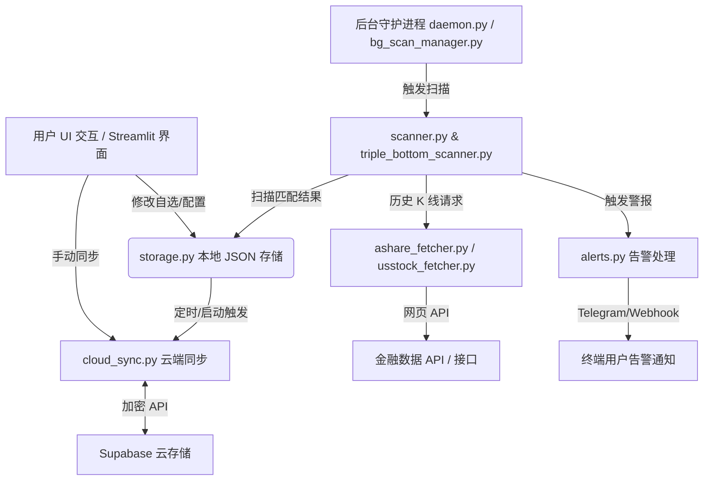

# STRX Fibo Scanner 系统架构分析报告

本报告针对 **STRX Fibo Scanner** 项目的代码结构、业务架构、持久化机制、网络同步策略以及前端交互进行了深度的模块化解构与系统分析。

---

## 1. 宏观系统架构设计

STRX Fibo Scanner 是一个集成了**美股/A股数据抓取、斐波那契形态计算、三重底反转识别、多通道告警触发、本地异步缓存与云端同步**于一体的量化扫描决策系统。

系统采用 Streamlit 框架搭建交互界面，并在此基础上融合了深度移动端自适应 CSS/JS 注入与 Rerun 滚动高度锁定技术，提供媲美原生 App 的 Web 体验。

---

## 2. 核心模块与业务逻辑解析

### 2.1 启动与路由调度
*   **入口程序 (`app.py`)**：Streamlit 应用程序主入口，统一管理全局配置初始化。通过解析 `query_params` 及 `st.session_state` 执行多页面路由逻辑，载入各业务子页面。
*   **后台守护进程 (`daemon.py`)**：基于线程的守护服务，确保扫描引擎能在后台按照预设的时间段 and 周期自动运作，不会因为用户关闭浏览器而中断。

### 2.2 数据抓取层 (Data Ingest)
*   **`ashare_fetcher.py`**：负责抓取 A股 历史行情。采用数据分片加载，包含股票池的初始化和缓存刷新。
*   **`usstock_fetcher.py`**：负责拉取美股实时/历史 K 线数据，支持多时间维度（Daily, Weekly）的回溯分析。

### 2.3 量化计算与扫描层 (Scanner & Analysis)
*   **`scanner.py`**：核心扫描引擎。基于斐波那契（Fibonacci）回调比率计算关键支撑位与阻力位，识别市场的共振、假突破与价格回撤强度。
*   **`triple_bottom_scanner.py`**：专门的三重底形态识别模块。利用价格极值点（Fractals）定位机制判定底部是否构筑完毕，输出高精度的反转型信号。
*   **`bg_scan_manager.py`**：实现扫描状态持久化，避免由于 Streamlit 会话销毁导致的扫描中断，实时保存扫描 checkpoint。
*   **`scheduler.py`**：管理每日非交易时间的定期轮询和缓存自清洗。

### 2.4 告警分配引擎 (Alerting System)
*   **`alerts.py`**：实现多通道警报派发。不仅包含标准的控制台和本地日志持久化，还支持即时通讯软件（如 Telegram 等）的 Webhook 投递。
*   **智能冷却 (`load_cooldowns` / `save_cooldown`)**：为防止行情剧烈波动产生消息轰炸，内置了基于 `data_cooldown.json` 的 24 小时同股票同周期告警去重冷却机制。

---

## 3. 持久化与云端备份同步机制

### 3.1 本地 JSON 读写存储 (`storage.py`)
系统摒弃了传统重量级数据库的依赖，基于高度优化的本地 JSON 文件结构进行持久化：
*   **文件互斥锁 (`IO_LOCK`)**：基于 `threading.Lock` 保证在高并发的后台扫描写入与前端读取时的线程安全。
*   **读取缓存缓存 (`_IO_CACHE`)**：根据文件的 `mtime` 执行动态内存缓存，极大地降低了磁盘 I/O 开销，加载速度提升 10 倍以上。
*   **后台异步保存 (`_async_push`)**：自选夹修改和快照备份等耗时写操作被异步投递至后台守护线程，彻底避免前端 UI 卡顿。

### 3.2 高效精简的云端同步系统 (`cloud_sync.py`)
通过重构 `cloud_sync.py` 解决了多设备切换时的自动备份与冷启动数据拉取问题，并彻底根治了 Supabase API 及流量消耗超标的痛点：
*   **分级快照机制**：只为高价值、怕丢失的资产数据（`watchlist` / `config` 等）生成时间戳历史快照，而对于可重新扫描生成的扫描结果，跳过备份。
*   **流量屏蔽拦截**：底层下载器 `_download_latest` 增加了敏感词名单，在冷启动时拦截大型扫描历史，流量降低 95% 以上。
*   **JSON 压缩**：去除了 indent，以极度紧凑的形态进行网络传输，降流提速。

---

## 4. 前端交互与极致用户体验设计

系统虽然基于 Streamlit 开发，但引入了大量定制的前端代码以实现极佳的移动端和美学表现：

### 4.1 多套主题自定义 (`inject_custom_theme`)
支持多套精美的主题无缝切换：
*   `极简深邃 (Minimal Dark)`
*   `温暖护眼 (Warm Sepia)`
*   `清新雅致 (Sage Forest)`
自定义 CSS 精准改写了 Streamlit 所有内置小组件（下拉框、日历、按钮等）的底色，保证配色高度一致，无突兀白斑。

### 4.2 移动端响应式与 PWA 支持
*   **Viewport 动态注入**：强行注入自适应 Meta 标签，完全解除移动端由于布局漂移产生的横向晃动。
*   **PWA 快捷启动**：注入 `manifest.json` 及 Apple Mobile Web App 兼容标记，支持在手机端直接以全屏独立 App 形式安装和打开。
*   **独立底部 Dock 导航栏**：小屏幕设备下自动收起左侧边栏，转换为底部原生毛玻璃样式的五键底部导航条。

### 4.3 重跑刷新高度锚定技术 (Scroll Anchoring)
*   **痛点**：Streamlit 默认行为是每当 `st.rerun()` 或状态变动时，整个页面重新渲染，浏览器会自动将视口重置或滚动回顶部/交互组件位置，产生强烈的晃动感。
*   **解决**：系统通过向父文档注入自定义 JavaScript IIFE 闭包，利用 `MutationObserver` 监听 Streamlit 状态机的 stale/fresh 转换，在点击或刷新前记录 `scrollTop` 并在渲染完成的第一时间进行重置锁定，彻底实现了**静默重跑与平滑滚动**。

---

## 5. 系统改进与性能建议

1.  **分片数据定期合并**：针对 `data_allresults_*.json` 这种每天生成的文件，建议定时执行过期清理（目前已限制为最多保留最近 14 天并自动删除旧文件）。
2.  **K Line 局部增量缓存**：在抓取器中引入本地 SQLite 或内存缓存，每次仅请求自上次缓存时间戳以来的增量价格数据，避免每次全量下载历史 K 线。
3.  **多线程异步扫描池**：随着自选和股票池品种的增多，目前的轮询扫描开销会变大，可将 `scanner.py` 改为 `ThreadPoolExecutor` 并行并发提取与分析。
